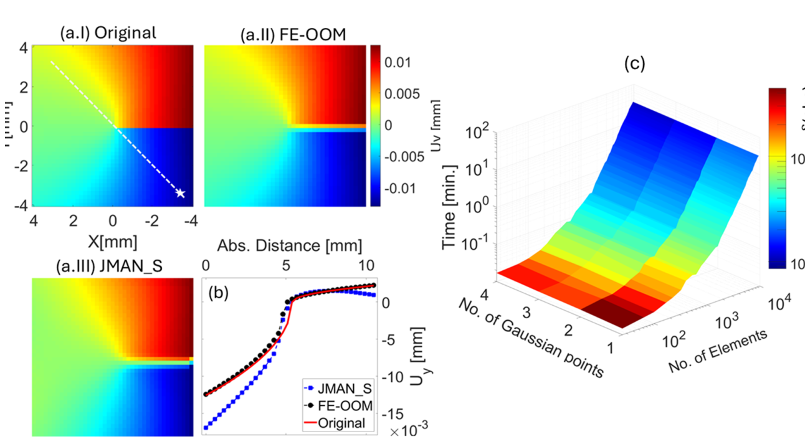
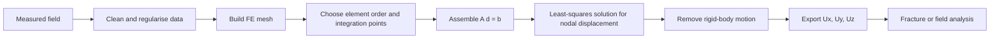
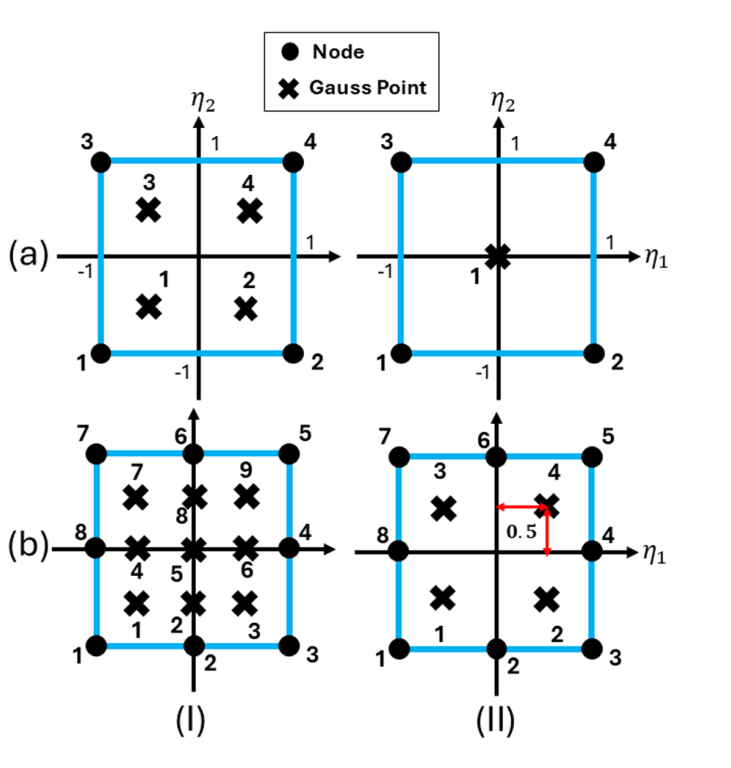
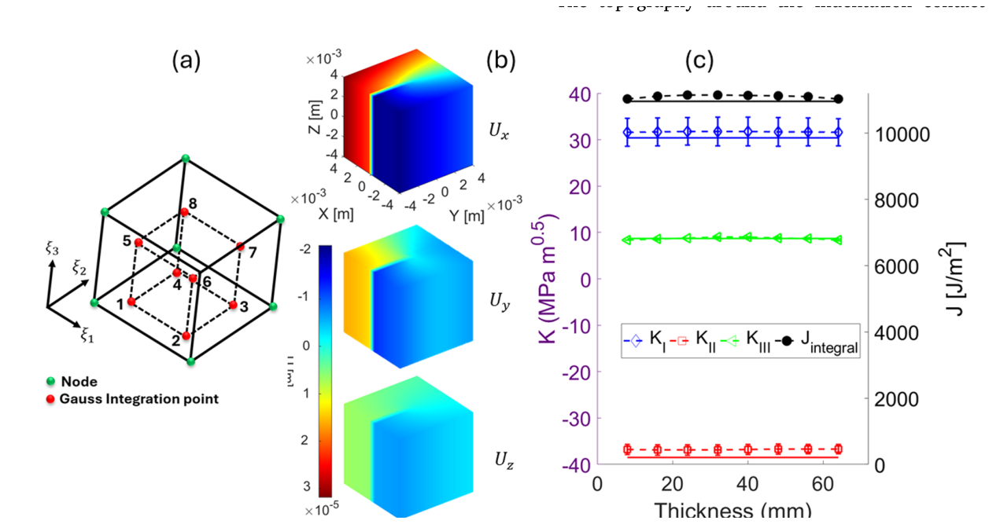
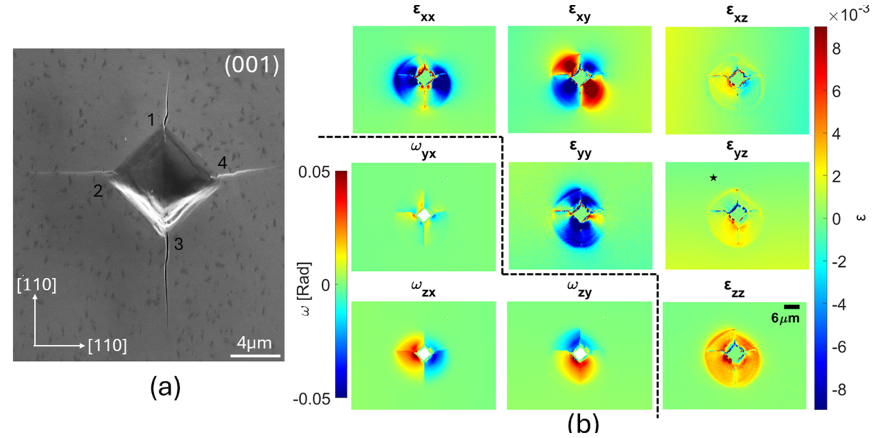
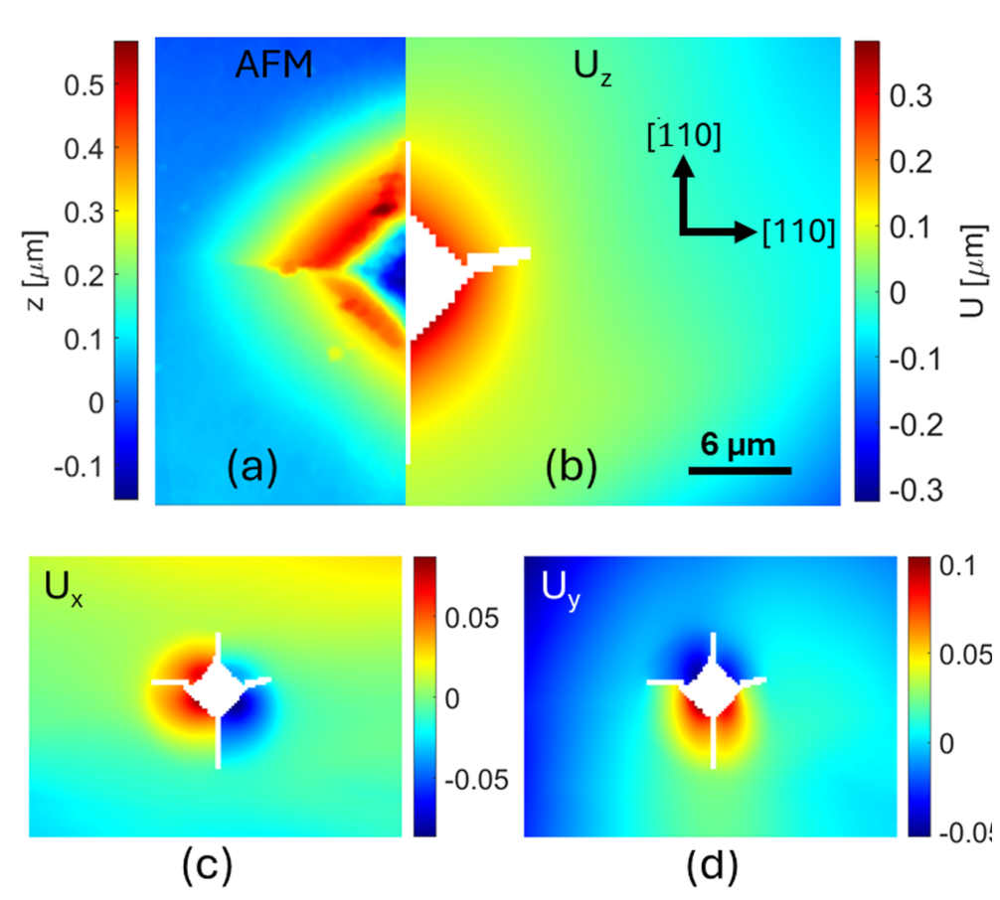

<h1 align="center">Strain2Disp_FE</h1>

<p align="center">
  <b>Finite-element reconstruction of displacement fields from measured strain or deformation-gradient maps</b>
</p>

<p align="center">
  
  
  
  
  
</p>

---

## Overview

**Strain2Disp_FE** reconstructs displacement fields from measured strain or deformation-gradient fields using a finite-element least-squares formulation. It is designed for cases where high-resolution experiments provide rich local strain information but not the full displacement field required for fracture-mechanics quantities such as the `J`-integral and stress intensity factors.

The method is especially useful for experimental mechanics workflows involving:

- high-angular-resolution electron backscatter diffraction (**HR-EBSD**),
- diffraction-based strain mapping,
- 2D and 3D crack-tip benchmark fields,
- indentation-induced cracks,
- displacement reconstruction before Abaqus-based fracture analysis,
- extraction of K<sub>I</sub>, K<sub>II</sub>, K<sub>III</sub> and `J` from reconstructed fields.

The central idea is simple: measured strain or deformation-gradient components are treated as known quantities, while nodal displacements are treated as unknowns. The domain is discretised with finite elements, the displacement-gradient equations are assembled over the measurement points, and the resulting overdetermined system is solved in a least-squares sense.

<p align="center">
  
</p>

<p align="center"><em>2D validation using a synthetic crack-tip field. The finite-element reconstruction reproduces the displacement field more accurately than a finite-difference-style integration route.</em></p>

---

## Why this tool exists

Modern full-field experiments can measure strain with excellent spatial resolution. However, strain fields alone do not always provide the individual displacement-gradient terms needed for fracture analysis. For example, the shear strain contains coupled displacement-gradient terms, but the `J`-integral requires specific displacement derivatives.

This toolbox fills that gap by converting measured local deformation information into a mechanically usable displacement field.

In practical terms:

```text
measured strain / deformation-gradient field
        -> finite-element least-squares integration
        -> continuous displacement field
        -> fracture parameters, validation, visualisation, or Abaqus input
```

---

## What the method does

The workflow can be summarised as follows.



The formulation supports two major input families:

| Input family | Typical source | Reconstructed output |
|---|---|---|
| 2D strain fields | HR-EBSD, DIC-derived strain, analytical benchmarks | `U<sub>x</sub>`, `U<sub>y</sub>` |
| 3D strain or deformation-gradient fields | 3D diffraction, DVC-derived gradients, synthetic benchmarks | `U<sub>x</sub>`, `U<sub>y</sub>`, `U<sub>z</sub>` |

---

## Features

- Finite-element integration of measured strain or deformation-gradient data.
- 2D and 3D formulations.
- Linear and quadratic element concepts.
- Least-squares solution of overdetermined displacement-gradient systems.
- Synthetic validation using crack-tip fields.
- HR-EBSD application to indentation-induced cracks.
- Optional post-processing for rigid-body translation and rotation removal.
- Reconstructed displacement fields suitable for downstream fracture analysis.
- Compatible with workflows where Abaqus is used to compute `J`, `K<sub>I</sub>`, `K<sub>II</sub>` and `K<sub>III</sub>`.

---

## Example applications

### 1. 2D mode-I crack-tip validation

The 2D benchmark integrates a synthetic crack-tip strain field and compares the reconstructed displacement field with the analytical displacement solution.

<p align="center">
  
</p>

<p align="center"><em>Linear and quadratic elements with reduced and full integration-point configurations.</em></p>

Typical use:

```matlab
addpath(genpath(pwd));

cfg = struct();
cfg.problem        = "2D_mode_I_validation";
cfg.inputType      = "strain";
cfg.dimension      = 2;
cfg.elementType    = "linear";     % linear or quadratic, depending on the implementation branch
cfg.integration    = "full";       % reduced or full
cfg.units          = "mm";
cfg.removeRigidBody = true;

% Use the repository's top-level driver or input desk for the 2D validation case.
% Example wrapper name if your branch exposes one:
% results = Strain2Disp_FE(cfg);
```

Expected outputs include reconstructed `U<sub>x</sub>` and `U<sub>y</sub>` maps, error maps, and line-profile comparisons against the analytical solution.

---

### 2. 3D mixed-mode crack-tip validation

The 3D benchmark reconstructs a displacement field from a synthetic mixed-mode crack field and checks whether the reconstructed field recovers the prescribed fracture parameters.

<p align="center">
  
</p>

<p align="center"><em>3D validation using a synthetic mixed-mode crack field and Abaqus-based fracture-parameter extraction.</em></p>

Typical use:

```matlab
addpath(genpath(pwd));

cfg = struct();
cfg.problem        = "3D_mixed_mode_validation";
cfg.inputType      = "strain";
cfg.dimension      = 3;
cfg.elementType    = "brick8";
cfg.integration    = "full";
cfg.units          = "mm";
cfg.exportAbaqus   = true;

% Use the repository's 3D validation driver or adapt the template above.
% results = Strain2Disp_FE(cfg);
```

Relevant reconstructed fields:

```text
Ux, Uy, Uz
H11, H12, H13, H21, H22, H23, H31, H32, H33
```

These fields can then be used for `J`-integral and mixed-mode SIF extraction.

---

### 3. HR-EBSD indentation-crack analysis

The experimental workflow reconstructs displacement fields from HR-EBSD elastic strain maps around Vickers-induced cracks in monocrystalline silicon.

<p align="center">
  
</p>

<p align="center"><em>HR-EBSD strain and lattice-rotation maps around an indentation-induced crack field.</em></p>

The reconstructed displacement fields can be compared against AFM-measured topography and used as boundary conditions for fracture analysis.

<p align="center">
  
</p>

<p align="center"><em>Comparison between measured AFM topography and reconstructed displacement fields.</em></p>

Typical use:

```matlab
addpath(genpath(pwd));

cfg = struct();
cfg.problem         = "HR_EBSD_indentation";
cfg.inputType       = "elastic_strain";
cfg.dimension       = 3;
cfg.units           = "um";
cfg.material        = "anisotropic_silicon";
cfg.depthResolution = 700;       % nm, example value used for the EBSD information depth
cfg.removeCracks    = true;
cfg.removeRigidBody = true;
cfg.exportAbaqus    = true;

% Use the repository's HR-EBSD input desk or driver.
% results = Strain2Disp_FE(cfg);
```

---

## Installation

Clone the repository and add it to your MATLAB path:

```bash
git clone https://github.com/Shi2oon/Strain2Disp_FE.git
cd Strain2Disp_FE
```

Then in MATLAB:

```matlab
addpath(genpath(pwd));
savepath;   % optional
```

Recommended environment:

- MATLAB R2021a or later.
- Optimisation or linear algebra routines available in base MATLAB.
- Abaqus, only if exporting reconstructed displacement fields for fracture analysis.

---

## Input data

The toolbox is intended for regular or regularised measurement grids. Typical inputs are:

### 2D field

| Column / array | Meaning |
|---|---|
| `X`, `Y` | measurement coordinates |
| `eps_xx`, `eps_yy`, `eps_xy` | in-plane strain components |
| optional `omega_xy` | in-plane rotation if available |

### 3D field

| Column / array | Meaning |
|---|---|
| `X`, `Y`, `Z` | measurement coordinates |
| `eps_xx`, `eps_yy`, `eps_zz` | normal strain components |
| `eps_xy`, `eps_xz`, `eps_yz` | shear strain components |
| optional `omega_xy`, `omega_xz`, `omega_yz` | lattice rotations if available |
| optional `F11` ... `F33` | deformation-gradient components |

For diffraction-based elastic strain maps, be careful about missing data, cracks, grain boundaries and pattern-centre artefacts. Poorly resolved or physically inconsistent fields will reconstruct poor displacement fields.

---

## Outputs

Typical outputs include:

| Output | Description |
|---|---|
| `U<sub>x</sub>`, `U<sub>y</sub>`, `U<sub>z</sub>` | reconstructed displacement components |
| `H<sub>ij</sub>` | reconstructed displacement-gradient components |
| `residual` | least-squares residual or reconstruction error measure |
| `mesh` | nodal coordinates and element connectivity |
| `figures` | displacement maps, validation plots and line profiles |
| Abaqus files | optional boundary-condition or model files for fracture analysis |

---

## Abaqus and fracture-parameter workflow

When the reconstructed displacement field is exported to Abaqus, the common downstream workflow is:

```text
reconstructed displacement field
        -> apply as boundary conditions or field constraints
        -> elastic or anisotropic constitutive model
        -> interaction-integral / domain-integral analysis
        -> J, K<sub>I</sub>, K<sub>II</sub>, K<sub>III</sub>
```

This is particularly useful when the experimental boundary conditions, loads or crack geometry are difficult to idealise analytically.

---

## Practical guidance

### Element choice

- Use linear elements for robust and efficient integration on dense regular grids.
- Use higher-order elements only where the measurement density and field smoothness justify the additional cost.
- In 3D, full integration is preferred when the data density is sufficient.

### Data cleaning

- Remove cracks, voids and non-material regions before integration.
- Mask unreliable HR-EBSD points, grain boundaries, damaged patterns and severe discontinuities.
- Keep a sufficiently large field of view around the defect.
- Do not interpret near-tip singular pixels as reliable integration constraints unless the measurement quality supports it.

### Rigid-body motion

Strain integration cannot determine absolute rigid-body translation or rotation. These should be corrected after reconstruction using a reference region or a physically motivated rigid-body removal step.

---

## Limitations

This is not a magic strain-to-truth converter. The quality of the reconstructed displacement field depends on the quality and physical consistency of the measured input field.

Important limitations:

- Diffraction-based strain mapping usually measures elastic strain, not total strain.
- Missing rotations or incomplete deformation-gradient information can limit uniqueness.
- Crack flanks, grain boundaries and discontinuities can introduce incompatibility.
- Out-of-plane displacement reconstruction depends on assumptions about measurement depth.
- Abaqus-derived fracture parameters remain sensitive to crack-tip placement, mesh construction and contour selection.

---

## Suggested repository structure

A clean project layout is:

```text
Strain2Disp_FE/
├── README.md
├── Data/
│   └── Assets/
│       ├── Fig1_FE_elements.png
│       ├── Fig2_2D_modeI_validation.png
│       ├── Fig3_3D_mixed_mode_validation.png
│       ├── Fig5_HR_EBSD_strain_rotation_maps.png
│       └── ...
├── Examples/
│   ├── 2D_ModeI_Validation/
│   ├── 3D_MixedMode_Validation/
│   └── HR_EBSD_Indentation/
├── functions/
├── src/
└── outputs/

---

## Citation

If you use this repository, please cite:

```bibtex
@article{Koko2026Strain2DispFE,
  title   = {Computation of displacements from strain fields: Derivation, validation, and application},
  author  = {Koko, Abdalrhaman and Elmukashfi, Elsiddig and Karamched, Phani S. and Marrow, T. James},
  journal = {Acta Materialia},
  volume  = {304},
  pages   = {121818},
  year    = {2026},
  doi     = {10.1016/j.actamat.2025.121818}
}
```

The article states that the associated code is available through Zenodo DOI `10.5281/zenodo.6411572`.

---

## Figure attribution

Figures in `functions/Assets` are extracted and cropped from:

> Koko, A., Elmukashfi, E., Karamched, P. S., and Marrow, T. J. **Computation of displacements from strain fields: Derivation, validation, and application.** *Acta Materialia* 304, 121818, 2026.

The article is open access under the Creative Commons Attribution 4.0 International Licence (**CC BY 4.0**). Cropping and README formatting changes were made for display clarity.

---

## Related repositories

- [DIC2ABAQUS](https://github.com/Shi2oon/DIC2ABAQUS) - DIC-to-Abaqus workflows for fracture analysis.
- [Defect_Descriptor](https://github.com/Shi2oon/Defect_Descriptor) - configurational-force and mixed-mode SIF extraction from measured fields.
- [Strain2Disp_FE](https://github.com/Shi2oon/Strain2Disp_FE) - finite-element reconstruction of displacement fields from measured strain or deformation-gradient maps.

---

## Contributing

Contributions are welcome, especially for:

- additional experimental examples,
- clearer input-desk templates,
- Abaqus export examples,
- uncertainty quantification,
- support for more diffraction data formats,
- documentation of 3D workflows.

Please open an issue or submit a pull request with a minimal reproducible example.
